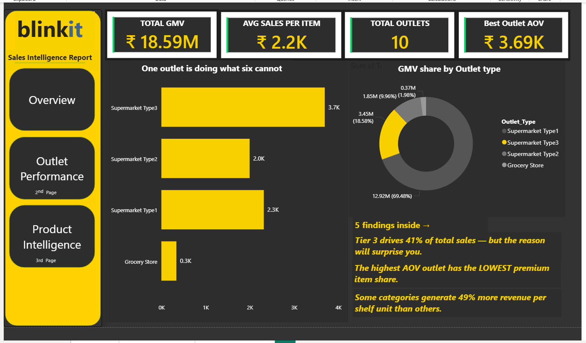
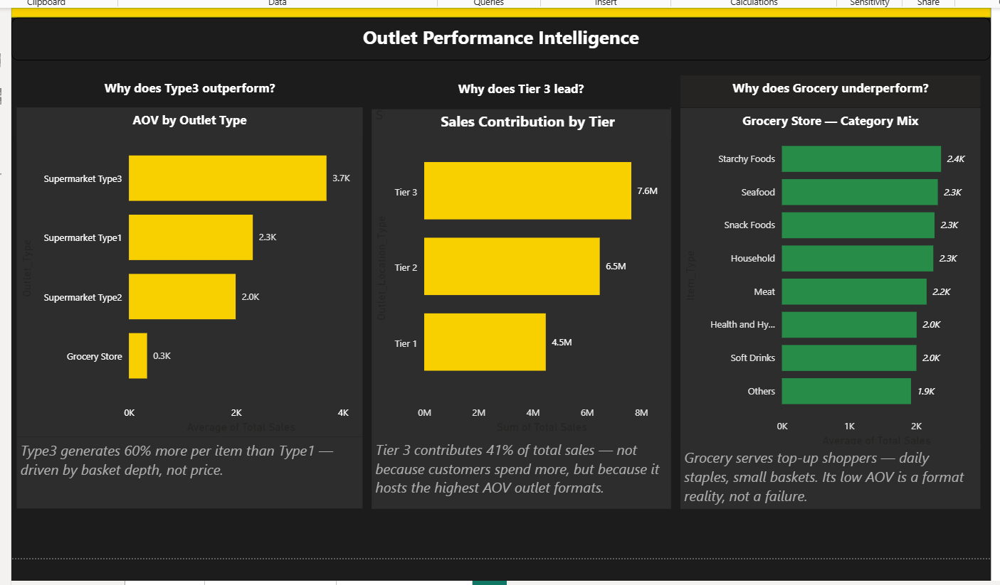
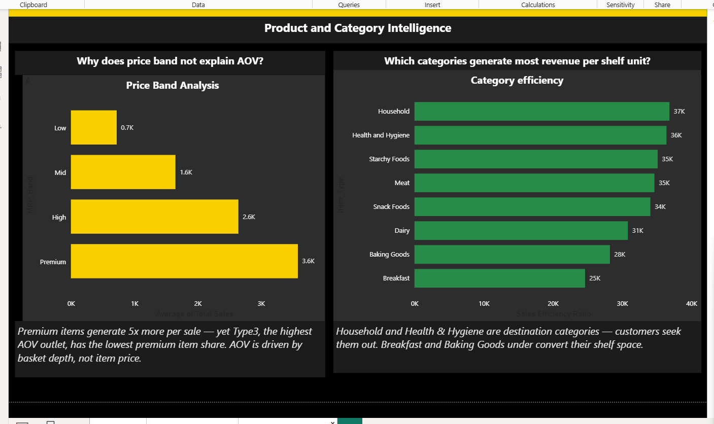
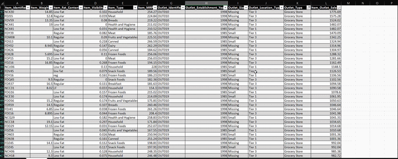

# Blinkit Sales & Outlet Performance Analysis

> *One outlet. 41 years. 10× the competition. Here is what the data revealed.*

---

## The Business Problem

Blinkit operates 10 outlets across 4 outlet types and 3 city tiers. The platform generates ₹1.86 Crore in total sales across 8,523 item records. But one number breaks the pattern completely:

**Supermarket Type3 generates an AOV of ₹3,694 — 60% above Type1, 85% above Type2, and 10× higher than Grocery Stores.**

The question this project set out to answer:

> *What is driving Type3's outperformance — and what would it take to replicate it?*

---

## Dashboard Preview

### Overview — Platform KPIs and the hook

### Outlet Performance Intelligence

### Product & Category Intelligence

## Behind the Analysis

The dashboard tells the story. This is where the story was found.

*Raw pivot table analysis in Excel — hypothesis testing, benchmarking, 
and RCA across 8,523 rows before a single Power BI visual was built.

---

## 5 Business Insights

### 1. Type3 wins on trust — not price
Three hypotheses were formed and tested: premium pricing, better shelf visibility, and outlet age. All three were rejected by the data. Type3 has the **lowest average MRP**, the **lowest visibility score**, and is a **single outlet** established in 1985. The real driver is 41 years of customer trust — expressed as basket depth. Customers visit less often but buy significantly more per visit.

**Recommendation:** Invest in customer retention over rapid expansion. Trust cannot be opened overnight.

---

### 2. Grocery Store's low AOV is a format reality — not a failure
Root cause analysis using the Five Whys methodology revealed that Grocery Store serves a completely different customer mission — daily top-up shopping, not full basket supermarket visits. Its ₹340 AOV is structurally correct for its format. Comparing it to Type3 is like comparing a chai stall to a restaurant on revenue per customer.

**Recommendation:** Measure Grocery on visit frequency and staple stock availability — not AOV.

---

### 3. Tier 3 leads due to a composition effect — not customer behaviour
Tier 3 contributes 41% of total sales — 17 percentage points above Tier 1. But Tier 3 exclusively hosts Type2 and Type3 outlets — the highest AOV formats. Type1 outlets show near-identical performance across all three tiers (₹2,192–₹2,439 AOV), revealing a standardisation operating model.

**Two strategic models identified:**
- **Type1 — Standardisation:** Same product mix, same pricing, same AOV everywhere. Fast, scalable, ideal for rapid expansion.
- **Type3 — Trust:** Performance built over 41 years. Not replicable quickly. Highest long-term return.

**Recommendation:** Use Type1's playbook to enter new markets fast. Build toward Type3's trust model over time.

---

### 4. AOV is driven by basket depth — not item price
Across all outlet types, the MRP band distribution is almost identical — roughly 48% Low, 35% High, 16% Premium. The premium item share range across outlets is only 2.35 percentage points. Yet AOV varies by 10×. Price mix does not explain performance. Volume per basket does.

**Opportunity:** Premiumisation — introducing slightly higher-priced variants of the low-band categories customers already buy in volume. Same habit. Higher price point. Meaningful AOV uplift over time.

---

### 5. Some categories generate 49% more revenue per shelf unit than others
A Sales Efficiency Ratio (avg sales ÷ avg visibility) revealed two category types:

| Category Type | Examples | Behaviour |
|---|---|---|
| Destination | Household, Health & Hygiene, Starchy Foods | Customers seek them out — visibility matters less |
| Impulse | Breakfast, Baking Goods, Dairy | Purchase triggered by visibility — underconverting current shelf space |

**Recommendation:** Move impulse categories to eye-level zones. Move destination categories to back-of-store to drive full-store customer journeys and increase basket size.

---

## Tools Used

| Tool | How it was used |
|---|---|
| **Excel** | Pivot tables, AVERAGEIFS, COUNTIFS, Power Query, data cleaning |
| **Power BI** | DAX calculated columns, measures, 3-page dashboard |
| **Python** | Pandas, NumPy for exploratory data analysis |
| **SQL** | Aggregation, GROUP BY, subqueries for hypothesis testing |

---

## About This Project

Every insight here was discovered through hypothesis testing — not template following. Three of my first five hypotheses were rejected by the data before the real answers emerged. That process — forming a hypothesis, testing it, watching it fail, and rebuilding — is what real analysis looks like.

**Author:** KS Sonu  
**Domain:** E-commerce / Quick Commerce  
**Contact:** ks.sonu@outlook.com | [LinkedIn](https://linkedin.com/in/ks-sonu/)
